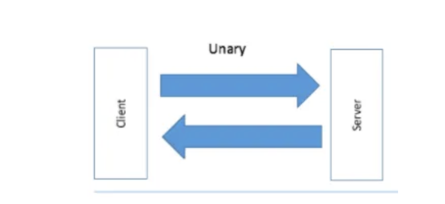

### Steps 

1. **Define a proto service** that contains a unary gRPC to create a laptop

2. **Implement server in Go** Write server side code to handle the unary RPC request and save laptop to an in-memory storage

3. **Implement client in Go** Write client-side code to call the unary RPC on server. Also write unit test for the interaction between client and server.

4. **Handle errors and deadline** Learn how to set deadline for the request, check for cancelation, handle errors, and return suitable status code to the client.

## What is Unary grpc 

Unary RPC calls are the basic Request/ Response that we are familiar with 



- The client will send a message to the server and will receive one response from the server 
- Unary RPC calls are the most common for APIS 
- in gRPC, Unary Calls are defined using Protocol Buffers 

After creating the `Laptop Request`, `Laptop Response` and `Service` in the `laptop_service.proto` file. Run `make gen` to generate the stub code for the proto file.

In `laptop_service.pb.go`,

```go
func (x *CreateLaptopRequest) GetLaptop()
```
`createLaptopRequest` struct has a Function to get the input laptop
Note - Why is this so ? This is because, in the `laptop_service.proto`file, we defined the field `laptop` in the createlaptop request 
```proto
message CreateLaptopRequest {
    Laptop laptop = 1;
}
```
So when the code is auto-generated by protoc, it automatically creates get functions in the `.pb.go` file for all fields. So that they can be accessed from the request. Thats why we have the `GetLaptop` function. 

```go 
func (x *CreateLaptopResponse) GetId() string 

```
`createLaptopResponse` struct has a function to get the output ID of the laptop
`GetID` function code was generated cause we have an Id field.


When defining the RPC service in `laptop_service.proto`. The service is named `Createlaptop`
```proto
service LaptopService {
    rpc CreateLaptop(CreateLaptopRequest) returns (CreateLaptopResponse) {};
}
```

In `laptop_service_grpc.pb.go` we have the `laptop service client interface`.
It is an interface because it will allow us implement our own custom client.E.g the mock client that will be used for unit testing.

```go 
type LaptopServiceClient interface
```

the `laptopServiceClient` struct implements the interface

Then we have the `laptopServiceServer` interface that has no implementation. This is because we are supposed to implement it ourselves. 
The interface has the `Createlaptop` function which has to satisfied by the laptopServer struct in `laptopServer.go`


The implementation is found in `laptop_server.go` file.

### LaptopServiceClient vs LaptopServiceServer

1. LaptopServiceClient Interface:

- This interface defines the client-side methods that the `gRPC client` can use to make requests to the `gRPC server`.
- There is a single method defined: `CreateLaptop`, which is a client-side method for creating a laptop.
- The client uses this interface to make remote procedure calls to the server, such as creating a laptop by `sending a request` and `receiving a response.`

2. LaptopServiceServer Interface:

- This interface defines the server-side methods that the gRPC server must implement to **handle incoming requests from clients**.
- The server implements these methods to handle the actual logic and behavior associated with the remote procedure calls.
- the corresponding server-side method is `CreateLaptop`, which is responsible for **handling requests to create a laptop and providing a response**.

(In the gRPC service, the client-side method (CreateLaptop) and the server-side method (CreateLaptop in the LaptopServiceServer interface) have the same name, but they serve different purposes and are implemented on different sides of the communication:)

To implement a gRPC service, you need to create a server that satisfies the LaptopServiceServer interface. The server-side implementation specifies how the service should handle incoming requests from clients.

```go
// Client-side method
func (c *LaptopServiceClientImpl) CreateLaptop(ctx context.Context, req *CreateLaptopRequest) (*CreateLaptopResponse, error) {
    // Logic to send the request to the server and receive the response
    // ...
}

// Server-side method
func (s *LaptopServiceServerImpl) CreateLaptop(ctx context.Context, req *CreateLaptopRequest) (*CreateLaptopResponse, error) {
    // Logic to handle the creation of a laptop on the server
    // ...
}
```


```go
func RegisterLaptopServiceServer(s grpc.ServiceRegistrar, srv LaptopServiceServer) {
	s.RegisterService(&LaptopService_ServiceDesc, srv)
}
```

The function above registers the Service on a specific grpc server, so that it can receive and handle requests from client.


## PROCEDURE 

- The `laptop_service.proto` file outlines a grpc service for creating laptops 
- `CreateLaptopRequest` is a message that *carries the details of a laptop to be created*.
- `CreateLaptopResponse` is a message that contains the identifier (id) of the newly created laptop.

- `service LaptopService` This is the service definition, and it contains the CreateLaptop RPC method. The method takes a CreateLaptopRequest as input and returns a CreateLaptopResponse.


### Server Implementation

- In `laptop_server.go` the server-side logic is implemented by creating a **Go struct that embeds the auto-generated server interface**(laptopServiceServer Interface). This struct(LaptopServer) is supposed to provide implementations for each of the service methods defined in the `laptop_service.proto` file. In this case we have the `Createlaptop` method

-  This function encapsulates the logic for creating and Initialising a laptopserver(dedicated function for creating instances)- it is a **constructor function**

```go
func NewLaptopServer() *LaptopServer {
	return &LaptopServer{}
}
```

- `laptop := req.GetLaptop()` - This is to get the laptop object from the request.

- `if len(laptop.Id) > 0`If the client has already generated the laptop Id, check if it is a valid uuid or not.

- summary- we want to  create a new laptop ,and to do that we need to get the details for creating from the request, which is why we have req.GetLaptop(). Then we do somechecks on the given id or generate a new one. Then we are supposed to save to a db. But instead we will use an in memory store.

- `data map[string]*pb.Laptop` we use a map to store the data, where the key is the laptop id and the value is the laptop object.

```go
res := &pb.CreateLaptopResponse{
		Id: laptop.Id,
	}
```
Create a new response object with the laptop ID and return it to the caller/client.

### Client Side 
Note -  the client code in `cmd/client/main.go` the CreateLaptop function is called on the gRPC client (laptopClient). However, the server-side implementation of `CreateLaptop` is invoked as part of the gRPC communication process.

```go
	conn, err := grpc.Dial(*serverAddress, grpc.WithInsecure())
```
- The client establishes a connection to the gRPC server using grpc.Dial with the specified server address.

```go
req := &pb.CreateLaptopRequest{
		Laptop: laptop,
	}

res, err := laptopClient.CreateLaptop(context.Background(), req)
```

- The client invokes the CreateLaptop RPC method on the server by calling laptopClient.CreateLaptop(context.Background(), req). This sends a request to the server with the created laptop as the payload.

- On the server side, the gRPC server processes the incoming request. Specifically, it `invokes the server-side implementation of the CreateLaptop method` that you defined in your LaptopServer implementation.

- The server-side implementation of CreateLaptop processes the request, creates a response (in this case, a CreateLaptopResponse containing an id), and sends the response back to the client.

```go
laptop := req.GetLaptop()
log.Printf("Received a create-laptop request with id: %s", laptop)
```

In the Createlaptop implementation of the server, this above is where the server receives the request from the client, This method `req.GetLaptop()` retrieves the value of the Laptop field from the request message.

#### The list above is further summarised below 

- Client Invocation:
    * When a gRPC client calls the CreateLaptop method, it creates an RPC request with the specified method name (CreateLaptop) and sends it to the server.

- Server-Side Invocation:
    * On the server side, the gRPC server intercepts the incoming request and dispatches it to the corresponding method in your LaptopServer implementation, in this case, CreateLaptop.

- Execution of Server-Side Logic:
    *  The server executes the logic you've implemented in the CreateLaptop method, which typically involves processing the request, performing business logic, and generating a response.

- Response to Client:
    *  The server sends the response back to the client, and the client's invocation of the CreateLaptop method returns with the result.

In summary, the gRPC framework facilitates the communication between a client and a server by invoking the appropriate method on the server based on the RPC call made by the client. This follows the standard Remote Procedure Call paradigm where a client invokes a method on a remote server, and the server executes the corresponding logic and returns a result.


### Communication
- The client creates a new Laptop object using sample.NewLaptop() and wraps it in a CreateLaptopRequest message.
- The client invokes the CreateLaptop RPC method on the gRPC server, sending the CreateLaptopRequest as the payload.
- On the server side, the CreateLaptop method is called, and it receives the CreateLaptopRequest containing the Laptop object.
- The server processes the request, which may involve validating the data, generating an ID if needed, and saving the laptop to some storage (e.g., a database or in-memory store) using the server.Store.Save(laptop) call.
- The server then generates a response (a CreateLaptopResponse containing the ID of the created laptop) and sends it back to the client.

